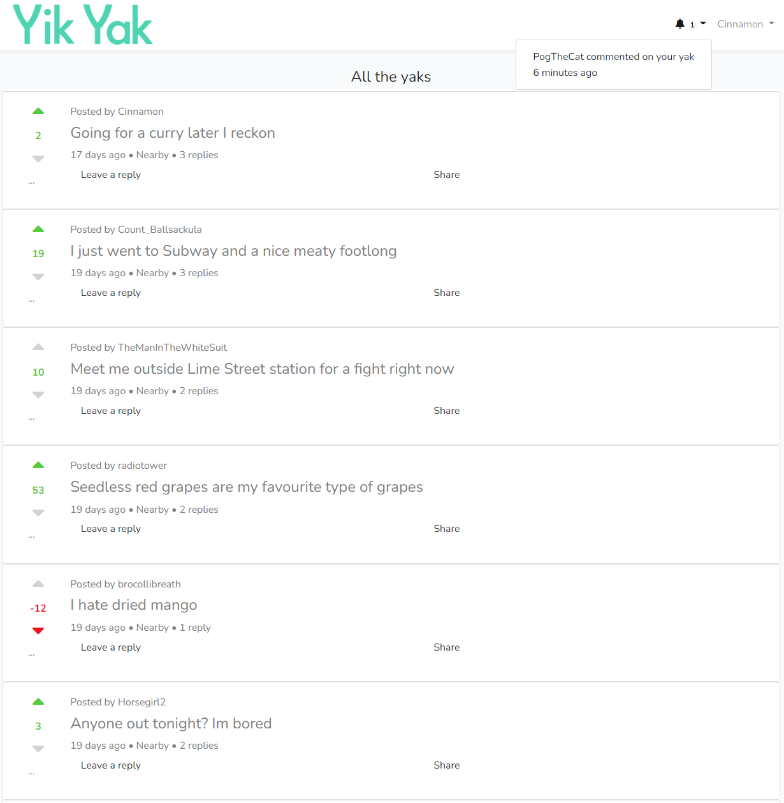

Yikyak inspired social media copy

Login into local mysql via terminal. `mysql -u root`  
Create a database called `create database yikyak;`  
Run the migrations `php artisan migrate`  
Add `--seed` to the end of the migration command to seed some data at the same time. Or `php artisan db:seed` to seed separately.
Note - seems the seeders need to be ran in a specific order or one doesn't work.

Notes for later
- requires livewire

To do
- Update the show yak page
    - Update the css for the replies
- Be able to view your own posts on your profile
- Be able to sort the homepage yaks by new / most popular in the last 7 days
- Add notifications
    - You have received 5, 10, 25, 50, 100 etc votes on your yak
    - When someone replies to your yak -> done
- Add location data
    - Add an option to post your yak in a community, have drop down list of all universities on post yak page for example
    - Add longitude and latitude of user who posted yak to each yak database entry
    - Users can also sort by yaks within a certain radius of themselves
